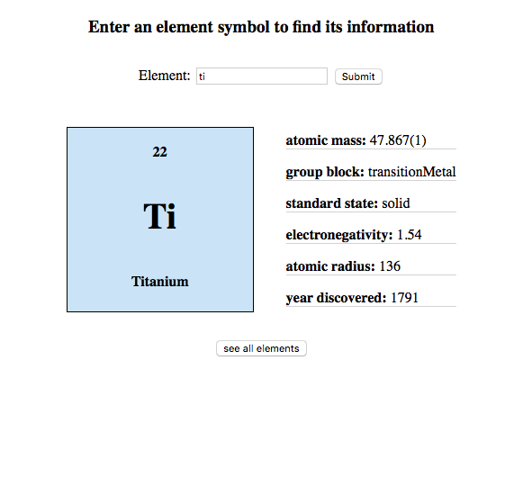
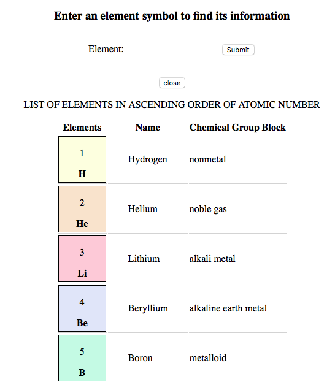
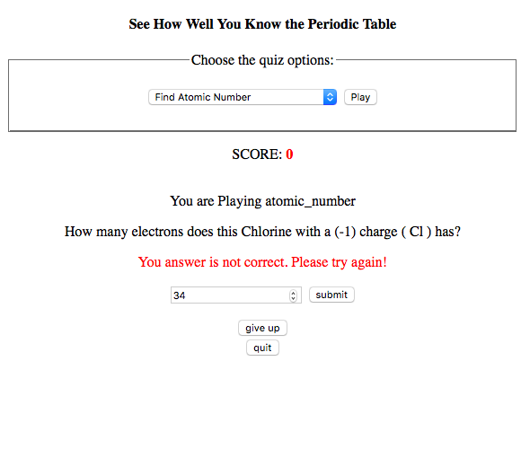
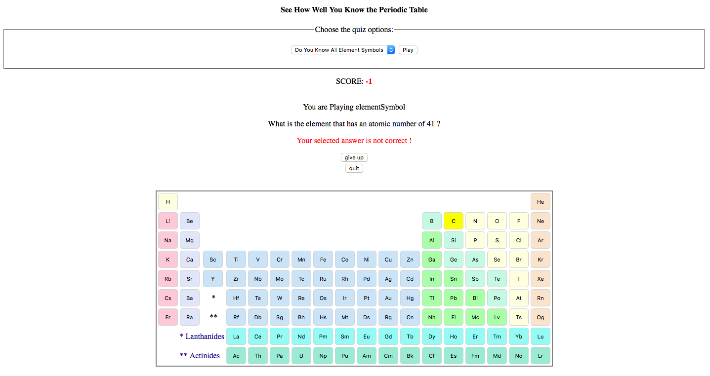
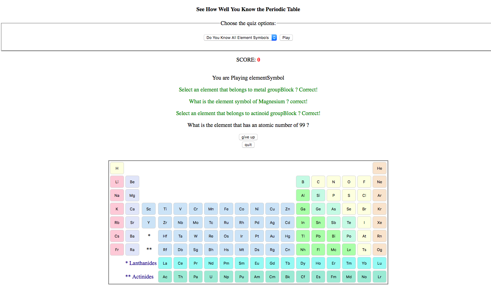

# Periodic-Table

A web tool for a chemical element information retrieval using periodic table API.

#### Chemical Element Search 
Search for specific element:

See all elements in the periodic table:

#### Quiz on Periodic Table 
Quiz option 1: Quiz on atomic number, number of protons/electrons for a given element.

Quiz option 2: Using the periodic table to find an element symbol given the atomic number, group block, period, and name.

